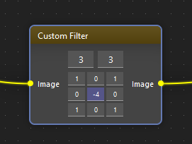

!description

Applies an user-defined filter

!wiki

The Custom Filter function allows users to apply a custom-defined filter to an image. This function empowers users to manipulate images according to their specific requirements, enhancing the flexibility and versatility of image analysis processes.

## Functionality

The Custom Filter operates by enabling users to define their custom filter kernel matrix. This matrix represents the coefficients used to convolve with the image pixels, thereby altering the image's characteristics based on the filter's specifications.

## Usage

### Parameters

- **Image**: The input image to which the custom filter will be applied.

### Attributes

- **Custom Filter Kernel Size**: A size for user-defined matrix.
- **Custom Filter Kernel**: A user-defined matrix specifying the coefficients of the custom filter.

## Considerations

- **Kernel Size**: Users should consider the size of the kernel matrix, as larger matrices may significantly affect processing time and computational resources.
- **Filter Coefficients**: The coefficients within the custom filter kernel matrix directly influence the characteristics of the resulting filtered image. Users should experiment with different coefficients to achieve desired effects.
- **Edge Effects**: When applying custom filters, users should be mindful of potential edge effects, which may cause distortion or artifacts near the image boundaries.

## Conclusion

The Custom Filter Application function provides users with the flexibility to define and apply custom filters to images, facilitating advanced image processing and analysis tasks. By allowing users to tailor filters according to their specific requirements, the function enhances the capabilities of the Image Analysis Tool, enabling more precise and personalized image manipulation techniques.
