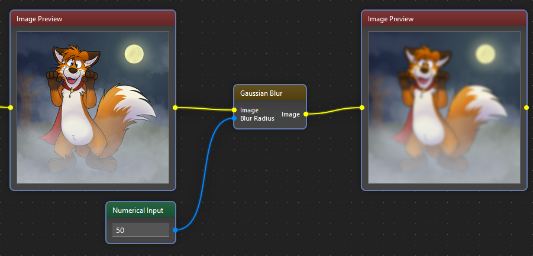

!description

Blurs the image using a Gaussian function (known also as Gaussian smoothing)

!wiki

The Gaussian Blur Filter is a commonly used image processing technique that applies a mathematical function known as a Gaussian function to blur an image. This filter is widely employed in various graphic design, photography, and computer vision applications to soften details, reduce noise, and create a more visually pleasing effect.

## Usage Example

### Inputs:

* **Image** - the image we want to apply the blur filter
* **Blur Radius** - positive integer value; the size of the applied filter

### Outputs:

* **Image** - blurred image

## How it Works

The Gaussian Blur Filter works by convolving the image with a Gaussian kernel, which is essentially a two-dimensional bell-shaped curve. This kernel assigns weights to each pixel in the image based on its distance from the center. Pixels closer to the center contribute more significantly to the blurred result, while those farther away have less impact.

The formula for the Gaussian function is given by:

\\[ G(x, y) = \frac{1}{2\pi\sigma^2} \cdot e^{-(\frac{x^2 + y^2}{2\sigma^2})} \\]

where:
- \\( G(x, y) \\) is the value of the Gaussian function at position \\((x, y)\\).
- \\( \pi \\) is the mathematical constant pi.
- \\( \sigma \\) is the standard deviation of the Gaussian distribution.

## Applications

* **Photography:** Softening skin tones, reducing noise, or creating artistic effects.
* **Computer Vision:** Preprocessing images for object detection, recognition, or tracking.
* **Graphic Design:** Creating visually appealing backgrounds or adding a sense of depth.

The Gaussian Blur Filter is a versatile tool that enhances images by smoothing out details, contributing to a variety of creative and practical applications in digital media.
