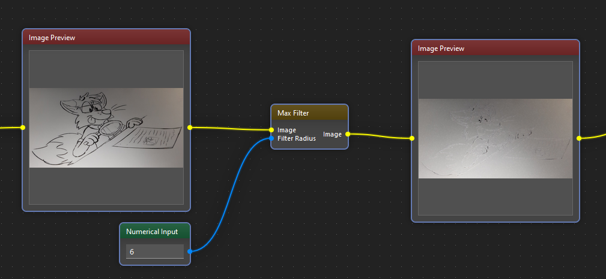

!description

Applies maximum filter

!wiki

## Overview

The Maximum Filter is a fundamental image processing operation aimed at enhancing image features by highlighting local maximum values within a defined neighborhood. This documentation provides an overview of the Maximum Filter functionality within the Image Analysis Tool, detailing its parameters, usage, and considerations for effective application.

## Functionality

The Maximum Filter operates by replacing each pixel's value in an image with the maximum value within the specified neighborhood centered around that pixel. This process enhances prominent features within the image while effectively reducing noise and smoothing minor fluctuations.

## Parameters

- **Image**: The input image to be processed using the Maximum Filter.
- **Filter Size**: The size of the neighborhood window used for computing the maximum value. It defines the extent of the local area considered around each pixel for maximum calculation.

## Usage Example

### Workflow

1. **Input Image Selection**: Users provide the image on which they wish to perform the Maximum Filter operation.
2. **Kernel Size Specification**: Users define the size of the neighborhood window for maximum calculation, typically represented as a square matrix.
3. **Filter Application**: The Maximum Filter algorithm is applied to the input image, replacing each pixel value with the maximum value within the defined neighborhood.
4. **Output Display**: The resulting image, post-application of the Maximum Filter, is displayed for user evaluation and analysis.

## Considerations

- **Kernel Size Selection**: The choice of kernel size impacts the filtering effect and the level of detail preserved in the resulting image. Larger kernel sizes provide smoother results but may blur finer features.
- **Computational Complexity**: Increasing the kernel size results in higher computational overhead. Users should consider the trade-off between filtering quality and processing time when selecting the kernel size.
- **Edge Effects**: The Maximum Filter may introduce artifacts or distortions near the image boundaries, especially with larger kernel sizes. Users should be mindful of potential edge effects and consider padding or boundary handling techniques to mitigate them.

## Conclusion

The Maximum Filter function serves as a valuable tool for enhancing image features and reducing noise through the identification of local maximum values within defined neighborhoods. By allowing users to specify the kernel size and tailor the filtering process to their specific requirements, the Maximum Filter function empowers advanced image processing and analysis tasks within the Image Analysis Tool, facilitating improved visualization and interpretation of image data.