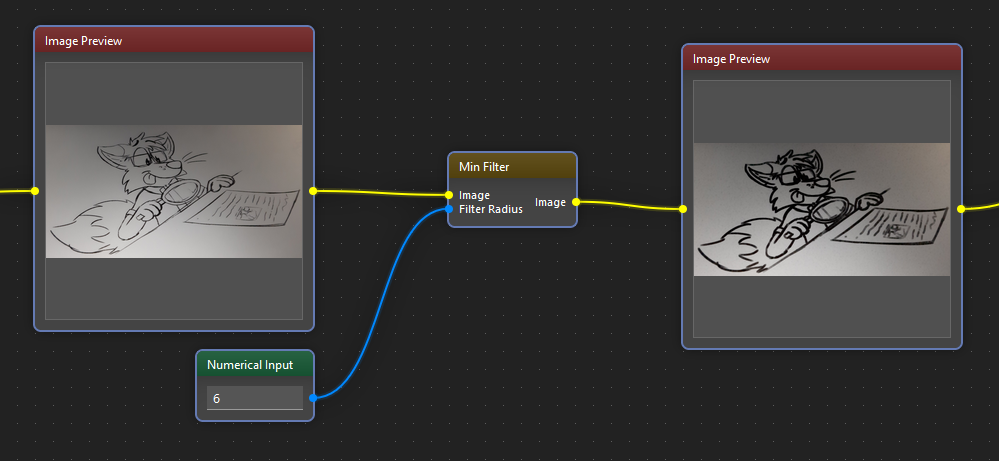

!description

Applies minimum filter

!wiki

# Minimum Filter Documentation

## Overview

The Minimum Filter is a fundamental image processing technique designed to enhance images by highlighting local minimum values within a specified neighborhood. This documentation provides a comprehensive overview of the Minimum Filter functionality within the Image Analysis Tool, outlining its parameters, usage guidelines, and considerations for optimal application.

## Functionality

The Minimum Filter operates by replacing each pixel's value in an image with the minimum value within the defined neighborhood centered around that pixel. This process effectively smooths minor fluctuations and reduces noise while preserving significant features and structural details within the image.

## Parameters

- **Image**: The input image to be processed using the Minimum Filter.
- **Filter Radius**: The size of the neighborhood window used for computing the minimum value. It determines the extent of the local area considered around each pixel for minimum calculation.

## Usage Example

## Considerations

- **Kernel Size Selection**: The choice of kernel size significantly influences the filtering effect and the level of detail preserved in the resulting image. Larger kernel sizes offer smoother results but may blur finer features.
- **Computational Complexity**: Increasing the kernel size results in higher computational overhead. Users should consider the trade-off between filtering quality and processing time when selecting the kernel size.
- **Edge Effects**: The Minimum Filter may introduce artifacts or distortions near the image boundaries, particularly with larger kernel sizes. Users should be aware of potential edge effects and employ appropriate padding or boundary handling techniques to mitigate them.

## Conclusion

The Minimum Filter function serves as a valuable tool for enhancing images by highlighting local minimum values within defined neighborhoods. By enabling users to specify the kernel size and customize the filtering process according to their specific requirements, the Minimum Filter function empowers advanced image processing and analysis tasks within the Image Analysis Tool, facilitating improved visualization and interpretation of image data.