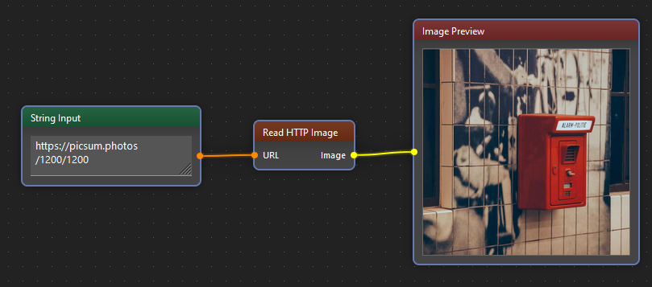

!description

Shows the image

!wiki

The Image Preview component enables users to view uploaded or processed images directly within the Image Analysis Tool's interface. It offers functionalities for displaying images, zooming in/out, panning, and adjusting the display settings for enhanced visualization and analysis.

