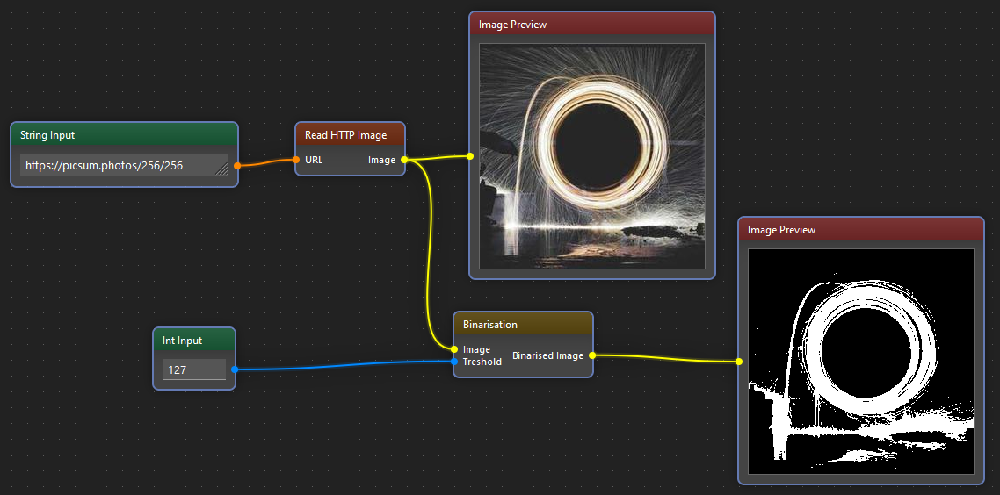

!description

Converts image to black and white

!wiki

The Binarisation Filter is a fundamental image processing technique used to convert a grayscale or color image into a binary image, where each pixel is classified as either black or white. This process is particularly useful in scenarios where the extraction of object boundaries or features requires a clear distinction between foreground and background.

## How it Works

Binarisation is achieved by establishing a threshold value, which determines whether a pixel's intensity should be classified as black or white. Pixels with intensities below the threshold are set to black, while those equal to or above the threshold are set to white.

## Parameters

- **Threshold Value:** This parameter is crucial in determining the effectiveness of the binarisation. Selecting an appropriate threshold depends on the characteristics of the image and the desired outcome. Some algorithms dynamically calculate the threshold based on image statistics.

- **Adaptive Binarisation:** In cases where the lighting conditions vary across the image, adaptive binarisation techniques are employed. These methods adjust the threshold locally, allowing for better results in different regions of the image.

## Usage

Binarisation filters are widely used in various applications, including document analysis, optical character recognition (OCR), and image segmentation. In programming and image editing tools, users can apply binarisation through specific functions or filters.

## Applications

* **Document Processing:** Enhancing text readability and extracting information from scanned documents.
* **Object Detection:** Creating binary masks for identifying objects or regions of interest.
* **Segmentation:** Simplifying complex images by separating foreground and background.

Binarization filters play a crucial role in preprocessing images for various computer vision and pattern recognition tasks, providing a foundation for further analysis and interpretation.
