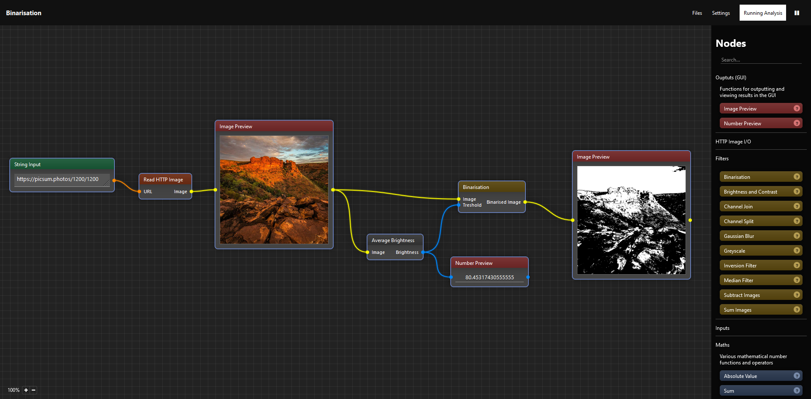

# Image Analysis Tool (Work In Progress)

Node-based extensive tool for image manipulation and analysis



## How to run it

1. Install Python 3.12 and pip
2. Clone the repository
3. Install required packages: ```$ pip install -r requirements.txt```
4. Start the program by running: ```$ python main.py```
5. Open the program in the web browser by going to http://127.0.0.1:5000 (on the local machine only)
